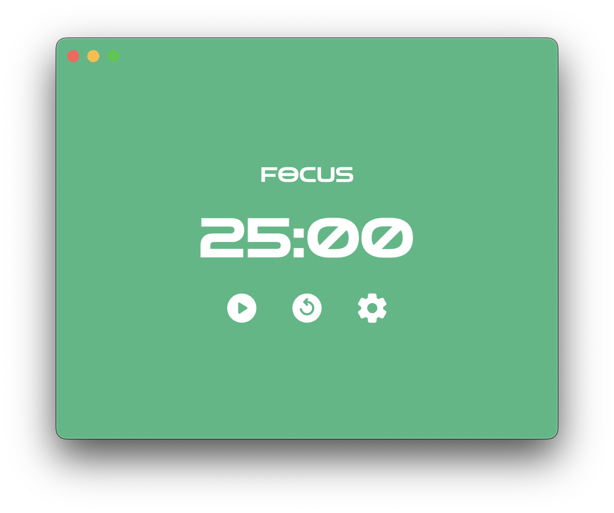
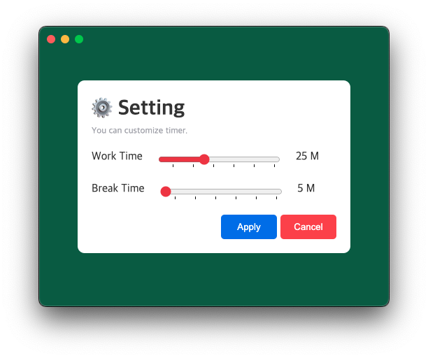
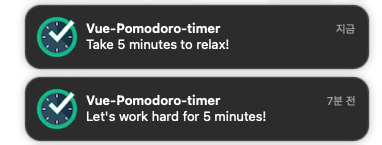

<header  style="text-align:center">
  <h1 >vue-pomodoro-timer</h1>
  <br/>
  <div>
    
  </div>
  <br/>
</header>

### ⏰ 개발 기간

2023.10 - 2023.11

### 🛠️ 기술 스택

- TypeScript
- Vue(Composition API)
- Electron

### 🚀 프로젝트 설명

Vue-pomodoro-timer는 집중 시간 관리를 위한 목적으로 개발하였습니다.

Vue-pomodoro-timer는 단순한 UI로 사용하기 쉬운 사용자 집중 시간 관리 타이머 데스크톱 앱입니다.<br/>
몇 가지 주요 기능은 아래와 같습니다.

- **데스크톱 앱으로 실행** : 웹 환경이 아닌 독립적인 데스크톱 앱으로 실행
- **사용자의 시간 설정** : 사용자의 설정을 통해 집중/휴식 시간 변경
- **Push 알림** : 설정한 시간 소요 시 푸시 알림 제공

### 🔎 프로젝트 상세

- **Electron**

  - 데스크톱 애플리케이션 구축을 위한 프레임워크
  - 네이티브 개발 경험이 없이 JavaScript로 MacOS, Window, Linux에서 동작하는 크로스 플랫폼 앱 구축 가능
    

- **사용자 시간 설정**

  - Vue의 단방향 데이터 흐름으로 인해 자식 컴포넌트에서 부모 컴포넌트의 데이터를 직접 업데이트하는 것은 권장되지 않음
  - 자식 컴포넌트에서 `emit`을 사용하여 커스텀 이벤트를 발신하여 부모 컴포넌트에서 데이터 변경하는 커스텀 이벤트 수신

  

  ```js
  // App.vue
  <Teleport to="body">
      <Transition name="setting-modal">
        <setting-modal
          v-if="isShowSettingModal"
          :currentWorkMin="currentWorkMin"
          :currentBreakMin="currentBreakMin"
          @close-modal="closeSettingModal" 👈 자식 컴포넌트로부터 커스텀 이벤트 수신
          @update-timer="updateTimer" />  👈 자식 컴포넌트로부터 커스텀 이벤트 수신
      </Transition>
    </Teleport>
  ```

  ```js
  // SettingModal.vue
  const emit = defineEmits(['close-modal', 'update-timer']); // emit 커스텀 이벤트 사용

  const closeSettingModal = (event?: Event) => {
    if (event) {
      if (
        event.target === backdrop.value ||
        event.target === modalApplyBtn.value ||
        event.target === modalCancelBtn.value
      ) {
        emit('close-modal'); // 커스텀 이벤트 close-modal 부모 컴포넌트에게 발신
      }
    }
  };

  const applyUpdateTime = () => {
    closeSettingModal();
    const updatedTime = {
      work: updatedWorkMin.value,
      break: updatedBreakMin.value,
    };

    emit('update-timer', updatedTime); // 커스텀 이벤트 update-timer 부모 컴포넌트에게 payload와 함께 발신
  };
  ```

- **Push 알림**

  - 사용자 설정 시간 소요 시 사용자에게 푸시 알림 제공

    - 사용자 설정 시간 소요 감지 : `Watcher` 활용
    - 푸시 알림 : JavaScript `Notifications API` 활용

    

  ```js
  watch(currentMode, (value) => {
    // Notifications API 허용 요청
    Notification.requestPermission().then((perm) => {
      // 승인(granted) 시 아래의 로직을 실행
      if (perm === 'granted') {
        // 모드 전환에 따라 다른 메세지 출력
        new Notification('Vue-Pomodoro-timer', {
          body:
            value === 'work'
              ? `Let's work hard for ${currentWorkMin.value} minutes!`
              : `Take ${currentBreakMin.value} minutes to relax!`,
        });
      }
    });
  });
  ```
